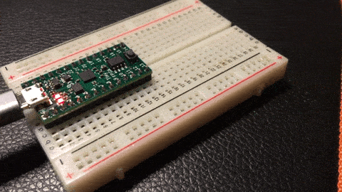

# Some TinyFPGABX Experiments in nMigen

 - blinky
 - USB Serial UART

# Dependencies
 - [NextPnr](https://github.com/YosysHQ/nextpnr)
You'll want to build nextPNR with support for at
least the ice40.
 - [yosys](https://github.com/YosysHQ/yosys)

You may wish to first create a Python
virtual environment since there are a lot
of Python dependencies.

```
cd ~/.virtualenvs
python3 -m venv tinyfpga
source tinyfpga/bin/activate
```

```
cd tinyfpgabx_experiments
pip3 install -r requirements.txt
```
# Using

## Blinky

Running ``python3 blinky.py`` should start blinking the
LED on the FPGA.



## Luna Simple ACM Serial Loopback

**Note:** synchronous logic that communicates with
the serial link must occur in the ``usb`` domain.

This is currently done with nMigen's
``DomainRenamer``

```
python3 serial_loopback.py
python3 driver.py
```

USB packets are sent/recieved directly to/from
the FPGA in ``serial_simple.py`` using libusb.

## Luna FSM Based Serial Loopback

Demonstrates how to drive the signals on
the Serial link directly with a simple 
state machine.

Also forms a loopback, but holds packet
payloads in memory instead.

```
python3 serial_fsm.py
python3 driver.py
```